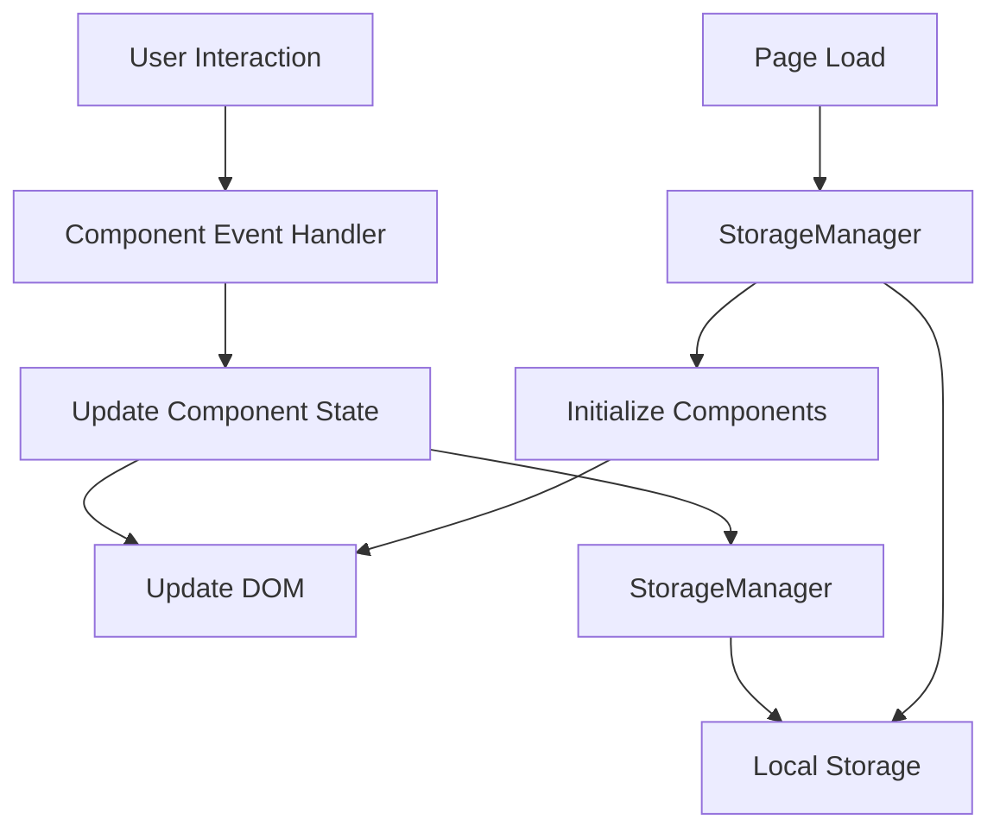

# Design Document: Productivity Dashboard

## Overview

The Productivity Dashboard is a single-page browser application built with vanilla JavaScript, HTML, and CSS. It provides four core productivity widgets in a unified interface: a dynamic greeting with time/date display, a 25-minute focus timer, a task list manager, and a quick links organizer. All user data persists in the browser's Local Storage, eliminating the need for backend infrastructure.

The application follows a component-based architecture where each widget operates independently but shares a common data persistence layer. The design prioritizes simplicity, maintainability, and immediate user feedback through synchronous DOM updates and efficient event handling.

### Key Design Principles

1. **Zero Dependencies**: Pure vanilla JavaScript with no frameworks or libraries
2. **Single Responsibility**: Each component manages its own state and DOM updates
3. **Immediate Persistence**: All data changes save to Local Storage synchronously
4. **Event-Driven Updates**: User interactions trigger immediate visual feedback
5. **Semantic HTML**: Accessible markup structure for screen readers and keyboard navigation

## Architecture

### Application Structure

The application follows a modular architecture with clear separation of concerns:

```
productivity-dashboard/
├── index.html          # Main HTML structure
├── css/
│   └── styles.css      # Single stylesheet for all components
└── js/
    └── app.js          # Single JavaScript file containing all logic
```

### Component Architecture

The JavaScript application is organized into five logical components:

1. **GreetingComponent**: Manages time, date, and greeting display with 1-second update interval
2. **TimerComponent**: Handles focus timer state (idle, running, paused) and countdown logic
3. **TaskListComponent**: Manages task CRUD operations and completion state
4. **QuickLinksComponent**: Handles link management and navigation
5. **StorageManager**: Centralized interface for Local Storage operations

### Data Flow



### Initialization Sequence

1. DOM Content Loaded event fires
2. StorageManager loads data from Local Storage
3. Each component initializes with stored data
4. Event listeners attach to interactive elements
5. GreetingComponent starts 1-second update interval
6. Application ready for user interaction

## Components and Interfaces

### GreetingComponent

**Responsibilities:**
- Display current time in 12-hour format with AM/PM
- Display current date with day of week, month, and day
- Show time-appropriate greeting (morning/afternoon/evening)
- Update display every second

**Interface:**
```javascript
class GreetingComponent {
  constructor(containerElement)
  init()                    // Start update interval
  updateDisplay()           // Refresh time, date, and greeting
  getGreeting(hour)         // Return appropriate greeting text
  formatTime(date)          // Format time as "HH:MM:SS AM/PM"
  formatDate(date)          // Format date as "Day, Month Date"
  destroy()                 // Clean up interval
}
```

**DOM Structure:**
```html
<div id="greeting-section">
  <div class="time-display">HH:MM:SS AM</div>
  <div class="date-display">Day, Month Date</div>
  <div class="greeting-text">Good morning</div>
</div>
```

### TimerComponent

**Responsibilities:**
- Manage 25-minute countdown timer
- Handle start, stop, and reset controls
- Display time in MM:SS format
- Provide notification when timer reaches zero

**State Machine:**
```
IDLE (25:00) --[start]--> RUNNING
RUNNING --[stop]--> PAUSED
PAUSED --[start]--> RUNNING
RUNNING --[reset]--> IDLE
PAUSED --[reset]--> IDLE
RUNNING --[reaches 0:00]--> COMPLETE
COMPLETE --[reset]--> IDLE
```

**Interface:**
```javascript
class TimerComponent {
  constructor(containerElement)
  init()                    // Set up event listeners
  start()                   // Begin countdown
  stop()                    // Pause countdown
  reset()                   // Return to 25:00
  tick()                    // Decrement by 1 second
  updateDisplay()           // Refresh timer display
  formatTime(seconds)       // Convert seconds to MM:SS
  onComplete()              // Handle timer completion
}
```

**DOM Structure:**
```html
<div id="timer-section">
  <div class="timer-display">25:00</div>
  <div class="timer-controls">
    <button id="timer-start">Start</button>
    <button id="timer-stop">Stop</button>
    <button id="timer-reset">Reset</button>
  </div>
</div>
```

### TaskListComponent

**Responsibilities:**
- Create, read, update, delete tasks
- Toggle task completion status
- Persist changes to Local Storage
- Display empty state message

**Interface:**
```javascript
class TaskListComponent {
  constructor(containerElement, storageManager)
  init()                    // Load tasks and set up listeners
  addTask(text)             // Create new task
  editTask(id, newText)     // Update task text
  deleteTask(id)            // Remove task
  toggleComplete(id)        // Toggle completion status
  renderTasks()             // Update DOM with current tasks
  saveToStorage()           // Persist tasks via StorageManager
  generateTaskId()          // Create unique task identifier
}
```

**DOM Structure:**
```html
<div id="task-section">
  <form id="task-form">
    <input type="text" id="task-input" placeholder="Add a new task...">
    <button type="submit">Add</button>
  </form>
  <ul id="task-list">
    <li class="task-item" data-id="unique-id">
      <input type="checkbox" class="task-checkbox">
      <span class="task-text">Task description</span>
      <button class="task-delete">Delete</button>
    </li>
  </ul>
  <div class="empty-message">No tasks yet. Add one to get started!</div>
</div>
```

### QuickLinksComponent

**Responsibilities:**
- Add and delete quick links
- Open links in new tabs
- Persist changes to Local Storage
- Display empty state message

**Interface:**
```javascript
class QuickLinksComponent {
  constructor(containerElement, storageManager)
  init()                    // Load links and set up listeners
  addLink(name, url)        // Create new link
  deleteLink(id)            // Remove link
  openLink(url)             // Open URL in new tab
  renderLinks()             // Update DOM with current links
  saveToStorage()           // Persist links via StorageManager
  generateLinkId()          // Create unique link identifier
  validateUrl(url)          // Ensure URL has protocol
}
```

**DOM Structure:**
```html
<div id="links-section">
  <form id="link-form">
    <input type="text" id="link-name" placeholder="Link name">
    <input type="url" id="link-url" placeholder="https://example.com">
    <button type="submit">Add</button>
  </form>
  <div id="links-container">
    <div class="link-item" data-id="unique-id">
      <a href="#" class="link-anchor" target="_blank">Link Name</a>
      <button class="link-delete">Delete</button>
    </div>
  </div>
  <div class="empty-message">No quick links yet. Add one to get started!</div>
</div>
```

### StorageManager

**Responsibilities:**
- Centralize all Local Storage operations
- Provide consistent interface for data persistence
- Handle serialization/deserialization
- Manage storage keys

**Interface:**
```javascript
class StorageManager {
  constructor()
  getTasks()                // Retrieve tasks array from storage
  saveTasks(tasks)          // Save tasks array to storage
  getLinks()                // Retrieve links array from storage
  saveLinks(links)          // Save links array to storage
  clear()                   // Clear all application data (for testing)
}
```

**Storage Keys:**
- `productivity-dashboard-tasks`: JSON array of task objects
- `productivity-dashboard-links`: JSON array of link objects

## Data Models

### Task Model

Represents a single to-do item with text content and completion status.

```javascript
{
  id: string,           // Unique identifier (timestamp-based)
  text: string,         // Task description (non-empty)
  completed: boolean,   // Completion status
  createdAt: number     // Unix timestamp for ordering
}
```

**Constraints:**
- `id` must be unique within the task list
- `text` must be non-empty string (whitespace trimmed)
- `completed` defaults to false for new tasks
- `createdAt` used for maintaining creation order

**Example:**
```javascript
{
  id: "task-1704067200000",
  text: "Review design document",
  completed: false,
  createdAt: 1704067200000
}
```

### Link Model

Represents a quick link to a website with name and URL.

```javascript
{
  id: string,           // Unique identifier (timestamp-based)
  name: string,         // Display name (non-empty)
  url: string,          // Full URL with protocol (non-empty)
  createdAt: number     // Unix timestamp for ordering
}
```

**Constraints:**
- `id` must be unique within the links list
- `name` must be non-empty string (whitespace trimmed)
- `url` must be non-empty string with protocol (http:// or https://)
- `createdAt` used for maintaining creation order

**Example:**
```javascript
{
  id: "link-1704067200000",
  name: "GitHub",
  url: "https://github.com",
  createdAt: 1704067200000
}
```

### Local Storage Schema

**Tasks Storage:**
```javascript
// Key: "productivity-dashboard-tasks"
// Value: JSON string of array
[
  { id: "task-1", text: "Task 1", completed: false, createdAt: 1704067200000 },
  { id: "task-2", text: "Task 2", completed: true, createdAt: 1704067300000 }
]
```

**Links Storage:**
```javascript
// Key: "productivity-dashboard-links"
// Value: JSON string of array
[
  { id: "link-1", name: "GitHub", url: "https://github.com", createdAt: 1704067200000 },
  { id: "link-2", name: "Gmail", url: "https://gmail.com", createdAt: 1704067300000 }
]
```


## Correctness Properties

*A property is a characteristic or behavior that should hold true across all valid executions of a system—essentially, a formal statement about what the system should do. Properties serve as the bridge between human-readable specifications and machine-verifiable correctness guarantees.*

### Property 1: Time Format Validity

*For any* Date object, the formatted time string should match the 12-hour format pattern "HH:MM:SS AM/PM" where HH is 01-12, MM and SS are 00-59, and the period is either AM or PM.

**Validates: Requirements 1.1**

### Property 2: Date Format Completeness

*For any* Date object, the formatted date string should contain the day of week, month name, and day number.

**Validates: Requirements 1.2**

### Property 3: Greeting Time Range Mapping

*For any* hour value (0-23), the greeting function should return "Good morning" for hours 5-11, "Good afternoon" for hours 12-16, and "Good evening" for hours 17-4.

**Validates: Requirements 1.3, 1.4, 1.5**

### Property 4: Timer Countdown Decrement

*For any* timer state greater than zero, calling tick() should decrement the remaining seconds by exactly one.

**Validates: Requirements 2.2**

### Property 5: Timer Stop Preserves State

*For any* timer state, stopping the timer should preserve the current time value without modification.

**Validates: Requirements 2.3**

### Property 6: Timer Reset Returns to Initial State

*For any* timer state, resetting should return the timer to exactly 1500 seconds (25:00).

**Validates: Requirements 2.4**

### Property 7: Timer Completion Triggers Notification

*For any* timer that reaches zero seconds, the onComplete handler should be invoked exactly once.

**Validates: Requirements 2.6**

### Property 8: Timer Format Validity

*For any* non-negative integer representing seconds, the formatted time should match the pattern "MM:SS" where MM is 00-99 and SS is 00-59.

**Validates: Requirements 2.7**

### Property 9: Task Creation Adds to List

*For any* valid (non-empty, non-whitespace) text string, creating a task should increase the task list length by exactly one and the new task should contain the provided text.

**Validates: Requirements 3.1**

### Property 10: Task Edit Updates Text

*For any* existing task and any valid new text, editing the task should update its text property to the new value while preserving its id and createdAt.

**Validates: Requirements 3.2**

### Property 11: Task Toggle Changes Completion Status

*For any* task, toggling completion should flip the completed boolean value (false to true or true to false).

**Validates: Requirements 3.3**

### Property 12: Task Deletion Removes from List

*For any* task list and any task id in that list, deleting the task should remove it from the list and decrease the list length by exactly one.

**Validates: Requirements 3.4**

### Property 13: Task List Maintains Creation Order

*For any* sequence of task creation operations, the resulting task list should be ordered by createdAt timestamp in ascending order.

**Validates: Requirements 3.5**

### Property 14: Empty Task Text Rejection

*For any* string composed entirely of whitespace characters (spaces, tabs, newlines) or empty string, attempting to create a task should be rejected and the task list should remain unchanged.

**Validates: Requirements 3.7**

### Property 15: Task Operations Persist to Storage

*For any* task operation (create, edit, delete, toggle completion), the operation should immediately update the tasks in Local Storage to match the current in-memory state.

**Validates: Requirements 4.1, 4.2, 4.3, 4.4**

### Property 16: Task Storage Round Trip

*For any* array of valid tasks, saving to storage and then loading should produce an equivalent array with all tasks having identical id, text, completed, and createdAt values.

**Validates: Requirements 4.5**

### Property 17: Link Creation Adds to List

*For any* valid (non-empty) name and URL, creating a link should increase the link list length by exactly one and the new link should contain the provided name and URL.

**Validates: Requirements 5.1**

### Property 18: Link Navigation Opens Correct URL

*For any* link with a valid URL, clicking the link should invoke window.open with that exact URL and target="_blank".

**Validates: Requirements 5.2**

### Property 19: Link Deletion Removes from List

*For any* link list and any link id in that list, deleting the link should remove it from the list and decrease the list length by exactly one.

**Validates: Requirements 5.3**

### Property 20: Link Rendering Includes Name

*For any* link, the rendered DOM element should contain the link's name as visible text.

**Validates: Requirements 5.4**

### Property 21: Empty Link Data Rejection

*For any* link creation attempt where name is empty/whitespace or URL is empty/whitespace, the creation should be rejected and the link list should remain unchanged.

**Validates: Requirements 5.5**

### Property 22: Link Operations Persist to Storage

*For any* link operation (create, delete), the operation should immediately update the links in Local Storage to match the current in-memory state.

**Validates: Requirements 6.1, 6.2**

### Property 23: Link Storage Round Trip

*For any* array of valid links, saving to storage and then loading should produce an equivalent array with all links having identical id, name, url, and createdAt values.

**Validates: Requirements 6.3**

## Error Handling

### Input Validation Errors

**Empty Task Text:**
- Trigger: User attempts to create task with empty or whitespace-only text
- Handling: Prevent task creation, maintain current state, optionally show validation message
- Recovery: User can enter valid text and retry

**Empty Link Data:**
- Trigger: User attempts to create link with empty name or URL
- Handling: Prevent link creation, maintain current state, optionally show validation message
- Recovery: User can enter valid data and retry

**Invalid URL Format:**
- Trigger: User enters URL without protocol (http:// or https://)
- Handling: Automatically prepend "https://" to the URL before saving
- Recovery: Automatic, no user action required

### Storage Errors

**Local Storage Quota Exceeded:**
- Trigger: Browser storage limit reached (typically 5-10MB)
- Handling: Catch exception, display error message to user
- Recovery: User must delete tasks/links to free space
- Prevention: Monitor storage usage, warn user when approaching limit

**Local Storage Unavailable:**
- Trigger: Private browsing mode or storage disabled
- Handling: Detect on initialization, display warning message
- Recovery: Application functions but data won't persist
- Fallback: Use in-memory storage for session

**JSON Parse Errors:**
- Trigger: Corrupted data in Local Storage
- Handling: Catch parse exception, log error, initialize with empty data
- Recovery: User loses corrupted data but application continues functioning
- Prevention: Validate data structure before saving

### Timer Errors

**Negative Time Values:**
- Trigger: Timer tick called when already at zero
- Handling: Clamp time to zero, prevent negative values
- Recovery: Automatic, timer stays at 00:00

**Invalid State Transitions:**
- Trigger: Attempting to stop a timer that's not running
- Handling: Ignore invalid operations, maintain current state
- Recovery: Automatic, no state corruption

### DOM Errors

**Missing Elements:**
- Trigger: Required DOM elements not found during initialization
- Handling: Log error to console, throw exception to prevent partial initialization
- Recovery: Developer must fix HTML structure
- Prevention: Validate all required elements exist before component initialization

**Event Listener Failures:**
- Trigger: Event listener attachment fails
- Handling: Log error, attempt to continue with other components
- Recovery: Affected component may not respond to user input
- Prevention: Ensure elements exist before attaching listeners

## Testing Strategy

### Overview

The testing strategy employs a dual approach combining unit tests for specific examples and edge cases with property-based tests for comprehensive validation of universal properties. This ensures both concrete correctness and general behavioral guarantees.

### Property-Based Testing

**Framework:** fast-check (JavaScript property-based testing library)

**Configuration:**
- Minimum 100 iterations per property test
- Each test tagged with feature name and property reference
- Tag format: `Feature: productivity-dashboard, Property N: [property text]`

**Property Test Coverage:**

1. **Greeting Component Properties (1-3)**
   - Generate random Date objects
   - Validate time format, date format, and greeting text
   - Test all hour values (0-23) for greeting ranges

2. **Timer Component Properties (4-8)**
   - Generate random timer states (0-1500 seconds)
   - Test countdown, stop, reset, and format operations
   - Verify state transitions and completion handling

3. **Task Component Properties (9-16)**
   - Generate random task lists and operations
   - Test CRUD operations, ordering, validation
   - Verify persistence round-trips with random data

4. **Link Component Properties (17-23)**
   - Generate random link lists and operations
   - Test creation, deletion, rendering, validation
   - Verify persistence round-trips with random data

**Generators:**
```javascript
// Example generators for property tests
fc.date()                          // Random dates
fc.integer(0, 23)                  // Hour values
fc.integer(0, 1500)                // Timer seconds
fc.string({ minLength: 1 })        // Non-empty strings
fc.webUrl()                        // Valid URLs
fc.array(taskGenerator)            // Task arrays
fc.array(linkGenerator)            // Link arrays
```

### Unit Testing

**Framework:** Jest or Mocha with Chai

**Focus Areas:**

1. **Edge Cases:**
   - Timer at zero (Property 2.5 edge case)
   - Empty task list (Property 3.6 edge case)
   - Empty link list (Property 5.6 edge case)
   - Empty storage initialization (Properties 4.6, 6.4 edge cases)

2. **Specific Examples:**
   - Timer initializes to 25:00 (Requirement 2.1)
   - Specific time formats: "03:45:12 PM", "12:00:00 AM"
   - Specific date formats: "Monday, January 1"
   - Specific greeting examples: 10 AM → "Good morning"

3. **Integration Points:**
   - Component initialization with StorageManager
   - Event listener attachment and triggering
   - DOM updates after state changes
   - Storage operations with mocked localStorage

4. **Error Conditions:**
   - Storage quota exceeded
   - JSON parse errors
   - Missing DOM elements
   - Invalid state transitions

**Test Organization:**
```
tests/
├── unit/
│   ├── greeting.test.js
│   ├── timer.test.js
│   ├── tasks.test.js
│   ├── links.test.js
│   └── storage.test.js
└── properties/
    ├── greeting.properties.test.js
    ├── timer.properties.test.js
    ├── tasks.properties.test.js
    └── links.properties.test.js
```

### Testing Balance

- **Unit tests** validate specific examples, edge cases, and integration points
- **Property tests** provide comprehensive coverage across all possible inputs
- Avoid excessive unit tests for cases already covered by property tests
- Focus unit tests on concrete scenarios that demonstrate correct behavior
- Use property tests to catch unexpected edge cases through randomization

### Manual Testing

**Browser Compatibility:**
- Test in Chrome 90+, Firefox 88+, Edge 90+, Safari 14+
- Verify Local Storage functionality in each browser
- Test private browsing mode behavior

**Accessibility:**
- Keyboard navigation through all interactive elements
- Screen reader compatibility with semantic HTML
- Color contrast validation with accessibility tools

**Performance:**
- Measure load time with browser DevTools
- Verify UI responsiveness with large datasets (100+ tasks/links)
- Test timer accuracy over extended periods

**Visual Design:**
- Verify consistent styling across components
- Check responsive behavior at different viewport sizes
- Validate whitespace and alignment

### Continuous Integration

**Automated Test Execution:**
- Run all unit tests and property tests on every commit
- Fail build if any test fails
- Generate coverage reports (target: 80%+ coverage)

**Pre-commit Hooks:**
- Run linter (ESLint) to enforce code style
- Run fast unit tests for immediate feedback
- Prevent commits with failing tests

